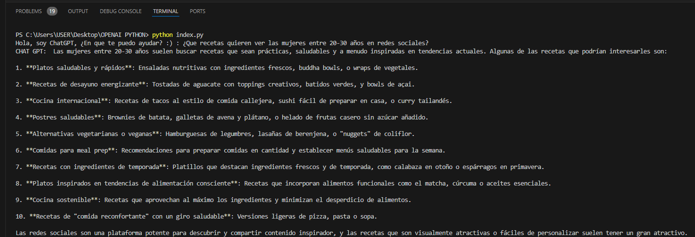
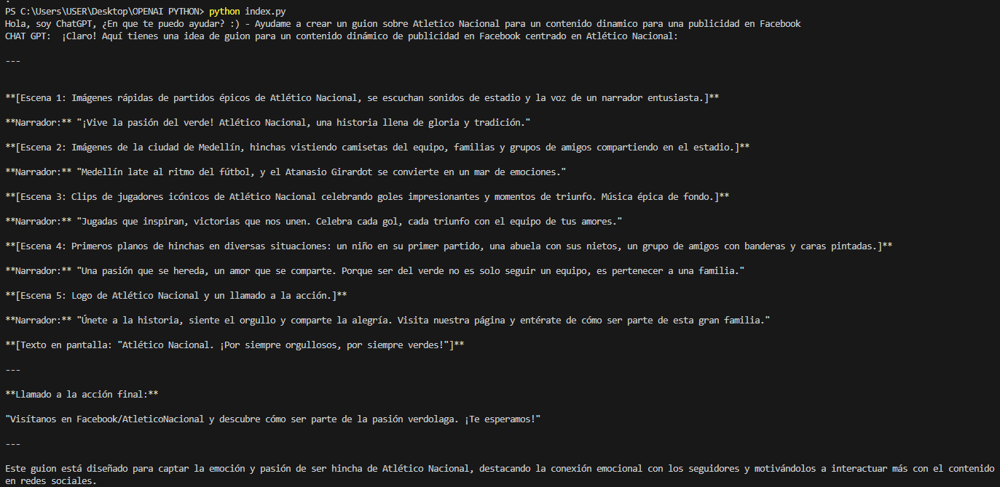

# INSTALACIÓN DE LIBRERIA DE OPENAI
A través del comando pip se hace la instalación de la librería de OPEN AI
```bash
pip install openai
```

# ENTRADA DE USUARIO
Se utilizo la funcion input para obtener el prompt de entrada del usuario y asignarlo a una variable

```python
prompt = input("Hola, soy ChatGPT, ¿En que te puedo ayudar? :) : ")
```

# SOLICITUD ENVIADA AL CLIENTE

Se utiliza la siguiente función para brindar la solicitud a la API con el prompt de entrada

```python
completion = client.chat.completions.create(
    model="gpt-4o",
    messages=[
        {"role": "user", "content": prompt}
    ]
)
```
# MANEJO DE RESPUESTA
Se obtiene la respuesta de parte del cliente por medio del siguiente metodo y mediante esa línea se obtene la respuetsa en consola.
```python
print("CHAT GPT: ", completion.choices[0].message.content)
```
```python
PS C:\Users\USER\Desktop\OPENAI PYTHON> python index.py
Hola, soy ChatGPT, ¿En que te puedo ayudar? :) : Dame 3 sabores de pizza
CHAT GPT:  Claro, aquí tienes tres sabores populares de pizza:

1. **Pizza Margherita**: Con salsa de tomate, mozzarella fresca y hojas de albahaca.
2. **Pizza Pepperoni**: Con salsa de tomate, mozzarella y rodajas de pepperoni.
3. **Pizza Hawaiana**: Con salsa de tomate, mozzarella, jamón y trozos de piña.

¡Espero que encuentres alguno de estos a tu gusto!
```
# SEGURIDAD PARA MANEJAR API Y DATOS SENSIBLES
Para manejar la seguridad de la API y los datos sensibles, se almacena la API KEY en una variable de entorno directamente en el computador, y el sistema al ejecutar el archivo, se setea y toman la información almacenada de la API que esta almacenada globalmente en el equipo. 

# APLICACIONES EN CONTEXTO DE MARKETING
En este contexto, se puede tomar como ejemplo, la publicidad por redes sociales, para consultarle a la API por medio del prompt el siguiente ejemplo:

- Publicidad en poblaciones femeninas entre los 20-30 años



```python
PS C:\Users\USER\Desktop\OPENAI PYTHON> python index.py
Hola, soy ChatGPT, ¿En que te puedo ayudar? :) : ¿Que recetas quieren ver las mujeres entre 20-30 años en redes sociales?
CHAT GPT:  Las mujeres entre 20-30 años suelen buscar recetas que sean prácticas, saludables y a menudo inspiradas en tendencias actuales. Algunas de las recetas que podrían interesarles son:

1. **Platos saludables y rápidos**: Ensaladas nutritivas con ingredientes frescos, buddha bowls, o wraps de vegetales.

2. **Recetas de desayuno energizante**: Tostadas de aguacate con toppings creativos, batidos verdes, y bowls de açai.

3. **Cocina internacional**: Recetas de tacos al estilo de comida callejera, sushi fácil de preparar en casa, o curry tailandés.

4. **Postres saludables**: Brownies de batata, galletas de avena y plátano, o helado de frutas casero sin azúcar añadido.

5. **Alternativas vegetarianas o veganas**: Hamburguesas de legumbres, lasañas de berenjena, o "nuggets" de coliflor.

6. **Comidas para meal prep**: Recomendaciones para preparar comidas en cantidad y establecer menús saludables para la semana.

7. **Recetas con ingredientes de temporada**: Platillos que destacan ingredientes frescos y de temporada, como calabaza en otoño o espárragos en primavera.

8. **Platos inspirados en tendencias de alimentación consciente**: Recetas que incorporan alimentos funcionales como el matcha, cúrcuma o aceites esenciales.

9. **Cocina sostenible**: Recetas que aprovechan al máximo los ingredientes y minimizan el desperdicio de alimentos.

10. **Recetas de "comida reconfortante" con un giro saludable**: Versiones ligeras de pizza, pasta o sopa.

Las redes sociales son una plataforma potente para descubrir y compartir contenido inspirador, y las recetas que son visualmente atractivas o fáciles de personalizar suelen tener un gran atractivo.

```
- Automatización de marketing (generación contenido dinamico)

Generación de idea de guión para un contenido dinamico para una publicidad



```python
PS C:\Users\USER\Desktop\OPENAI PYTHON> python index.py
Hola, soy ChatGPT, ¿En que te puedo ayudar? :) - Ayudame a crear un guion sobre Atletico Nacional para un contenido dinamico para una publicidad en Facebook
CHAT GPT:  ¡Claro! Aquí tienes una idea de guion para un contenido dinámico de publicidad en Facebook centrado en Atlético Nacional:

---


**[Escena 1: Imágenes rápidas de partidos épicos de Atlético Nacional, se escuchan sonidos de estadio y la voz de un narrador entusiasta.]**

**Narrador:** "¡Vive la pasión del verde! Atlético Nacional, una historia llena de gloria y tradición."

**[Escena 2: Imágenes de la ciudad de Medellín, hinchas vistiendo camisetas del equipo, familias y grupos de amigos compartiendo en el estadio.]**

**Narrador:** "Medellín late al ritmo del fútbol, y el Atanasio Girardot se convierte en un mar de emociones."

**[Escena 3: Clips de jugadores icónicos de Atlético Nacional celebrando goles impresionantes y momentos de triunfo. Música épica de fondo.]**

**Narrador:** "Jugadas que inspiran, victorias que nos unen. Celebra cada gol, cada triunfo con el equipo de tus amores."

**[Escena 4: Primeros planos de hinchas en diversas situaciones: un niño en su primer partido, una abuela con sus nietos, un grupo de amigos con banderas y caras pintadas.]**

**Narrador:** "Una pasión que se hereda, un amor que se comparte. Porque ser del verde no es solo seguir un equipo, es pertenecer a una familia."

**[Escena 5: Logo de Atlético Nacional y un llamado a la acción.]**

**Narrador:** "Únete a la historia, siente el orgullo y comparte la alegría. Visita nuestra página y entérate de cómo ser parte de esta gran familia."

**[Texto en pantalla: "Atlético Nacional. ¡Por siempre orgullosos, por siempre verdes!"]**

---

**Llamado a la acción final:**

"Visítanos en Facebook/AtleticoNacional y descubre cómo ser parte de la pasión verdolaga. ¡Te esperamos!"

---

Este guion está diseñado para captar la emoción y pasión de ser hincha de Atlético Nacional, destacando la conexión emocional con los seguidores y motivándolos a interactuar más con el contenido en redes sociales.

```
